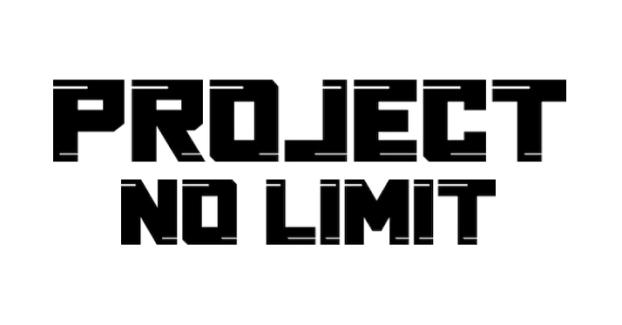

# <div align="center">Project-No-Limit<div align="center">
---

<p align="center">
  
</p>

#### <div align="center">Join our discord [here](https://discord.gg/gTkG3SrzbH)<div align="center"/>

## <div align="center">How to contribute: (Python 3.8.5 or greater.)<div align="center"/>

- ### Start by cloning the repository by:  
  Windows:
  ```bash
  git clone https://github.com/Wyverns/Limitless
  ```
  macOS:
  ```bash
  $ git clone https://github.com/Wyverns/Limitless
  ```
  Linux
  ```bash
  $ git clone https://github.com/Wyverns/Limitless
  ```
- ### Next set up your virtual environment:
  Windows:
  ```bash
  python -m venv venv
  pip install -U -r requirements.txt
  ```
  macOS:
  ```bash
  python3 -m venv env
  python3 -m pip install -U -r requirements.txt
  ```
  Linux:
  ```bash
  python3 -m venv env
  python3 -m pip install -U -r requirements.txt
  ```
  Alternatively if your on windows you can run our pre-made [setup.bat](setup.bat) file (It may say windows protected your pc, we are not trying to give you a virus I swear! You can look at the contents if you want [here](setup.bat))(you will still need to install required packages.)
  ```bash
  setup
  ```
- ### Next add your cog to [cogs.json](cogs.json) using this format:  
  ```json
  [
    {
      "Cogname": "Examplecog",
      "Author": "your name (excluding tag)",
      "path-to-cog": "path.to.cog",
      "description": "command description",
      "discord_id": "your-id"
    }
  ]
  ```
- ### Lastly compare the branches and make a pull request! 

#### Things to note:
- We will reject your pull request if your cog contains nsfw commands
- Do not expect us to merge if your code is unstable.
- We will reject your pull request if files are not in their specified locations (ie: an image in the main dir)
- We will not merge your pull request unless you have added your cogs to [cogs.json](cogs.json)
- We will not merge your pull request unless you use a virtual environment and add changes to requirements.txt
